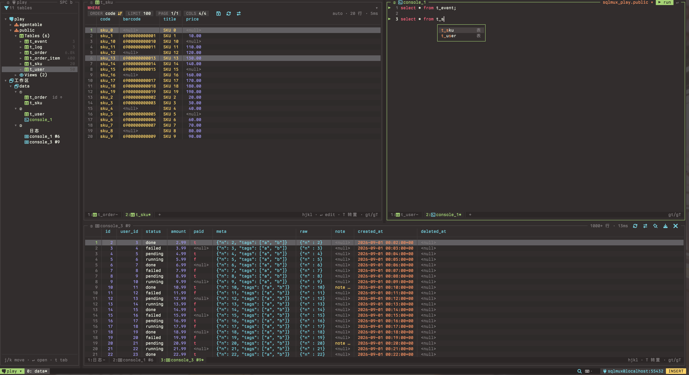

# sqlmux

A terminal database client organized the way tmux is: sessions, windows, panes and tabs. vim keys everywhere, mouse too. Written in Go with Bubble Tea v2.



> **Status: early development.** PostgreSQL only for now; MySQL is planned. The UI text is Chinese for now; an English UI is planned. Milestones are tracked in [specs/plan.md](specs/plan.md), and the design is in [specs/tech-design.md](specs/tech-design.md) (Chinese).

## What works today

- Schema tree: schemas → tables / views → columns, plus the open workspace.
- Table tabs: WHERE with completion and history, ORDER, LIMIT, paging, column picker, transpose.
- Inline editing: edit cells, then save everything in one transaction. Enum, boolean and time columns get pickers.
- SQL console: a vim editor that is diff-tested against nvim, with completion, formatting, a schema picker, and results in a bottom pane.
- Command palette (`C-p`) and quick SQL (`;`).
- Every key can be rebound, per pane type; `SPC` is the leader. Themes and Nerd Font icons are configurable (`icons = "ascii"` if you have no Nerd Font).

## Build

Requires Go 1.26+.

```sh
go build -o bin/sqlmux ./cmd/sqlmux
```

## Try it

Start the bundled PostgreSQL with sample data:

```sh
docker compose up -d --wait postgres
```

Add a connection to `~/.config/sqlmux/connections.toml`:

```toml
[[connection]]
name     = "seed"
engine   = "postgres"
dsn      = "postgres://sqlmux@localhost:55432/sqlmux?sslmode=disable"
password = "sqlmux"   # or password_cmd / password_env
```

Then run `bin/sqlmux` to open the first connection, or `bin/sqlmux <name>` to open another one. Press `C-c` twice to quit.

## Keys

`sqlmux keys` lists every action and its keys; `sqlmux keys --format toml` prints them as a `config.toml` snippet you can edit. `sqlmux keys --check` reports conflicts in your config.
